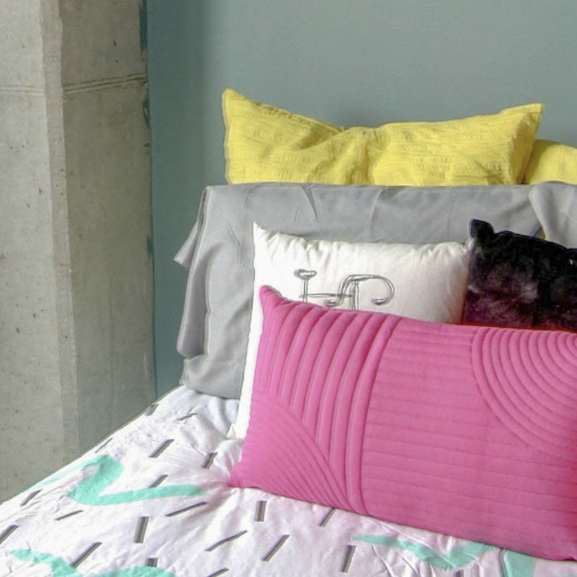
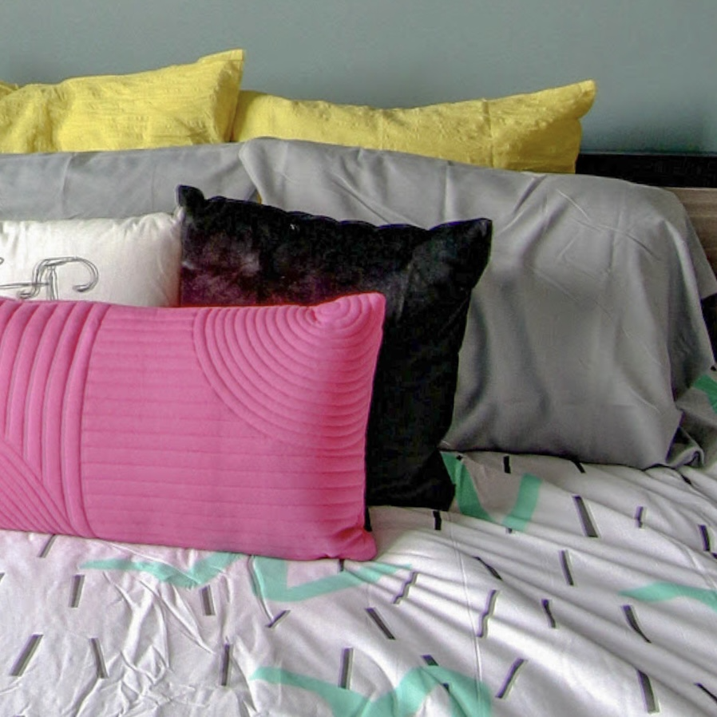
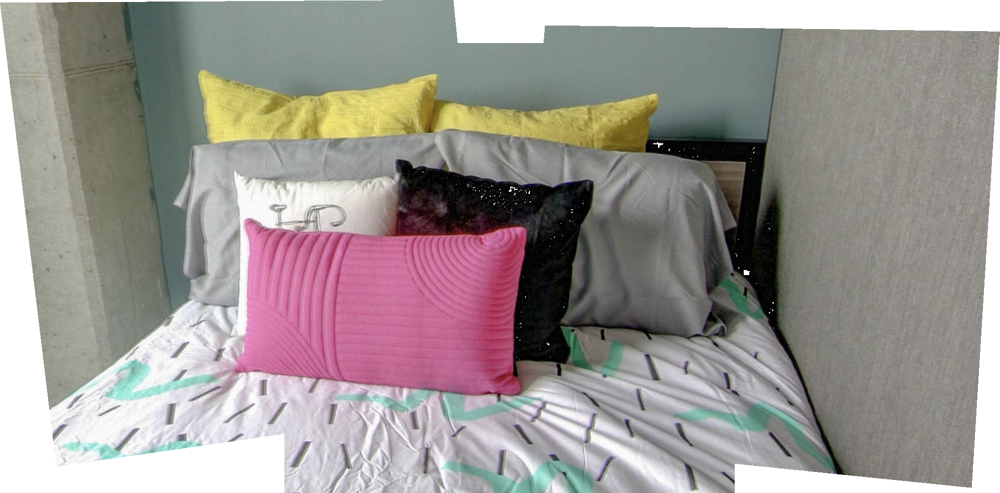

# Image-Mosaicking-App
An “Image Mosaicking App” that stitches a collection of photos into a mosaic. We use Homography, Correspondence, SIFT, RANSAC (RANdom Sampling And Consensus) to stitch images together.
Example Results:

